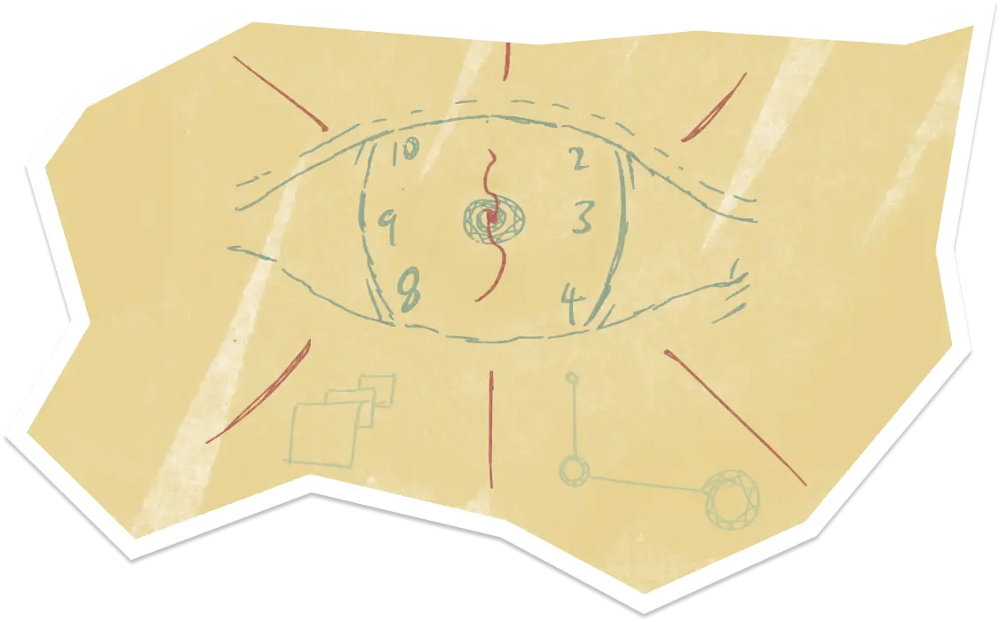
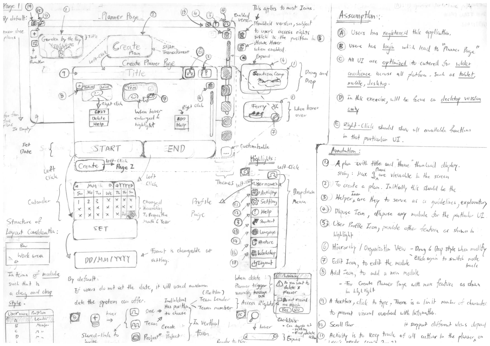
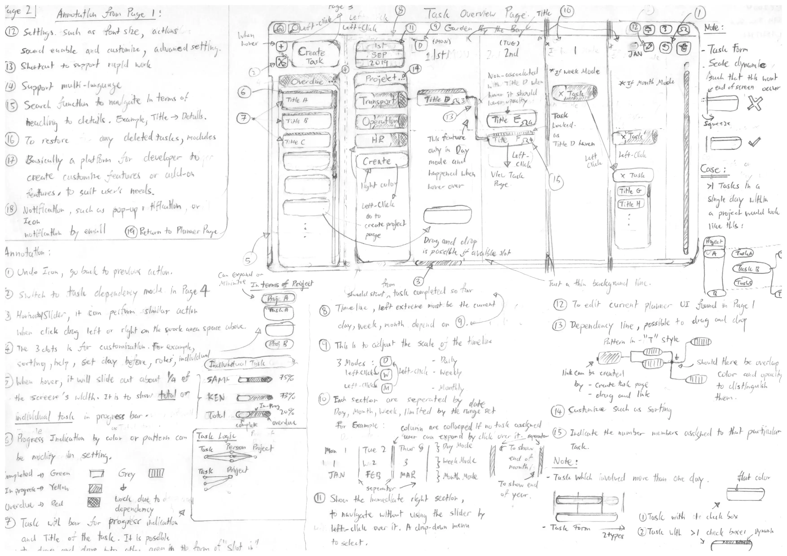
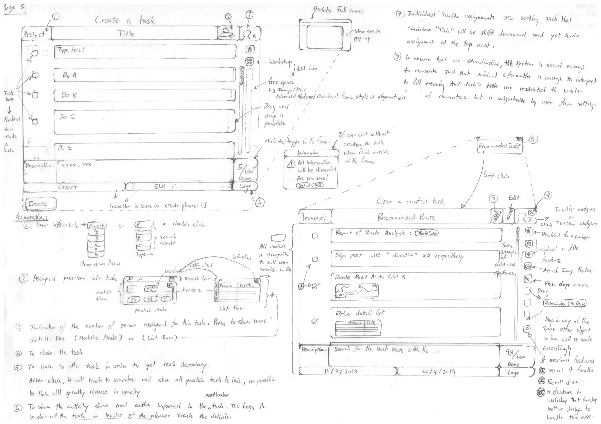
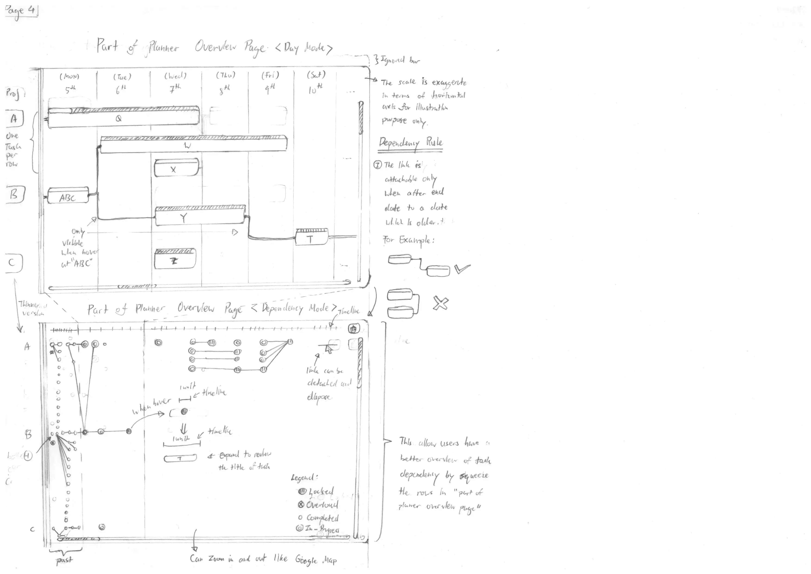

# Planiator

It is one of the [NTU](https://www.ntu.edu.sg/)'s CZ2004 Human Computer Interaction Module Project

## What?

We are tasks to design a user interface prototypes from lo-fi to hi-fi designs. The prototypes must be comprehensive enough to apply most of the design principles.

## Why?

To apply design principles we learnt from this module to experiment part of the ui/ux process.

## How?

1. Idealisation and potential user requirements
2. Draft down potential features and scoping into feasible tasks for the project duration
3. Draft out lo-fi design, repeat until all features is solidify
4. Draft out hi-fi design with all the fine details
5. Add visual effects to highlight critical features
6. connect ui flow or/and transition if necessary
7. Execute the prototypes to ensure it is within expected outcomes and requirements

## Highlights

Lo-Fi Design

Hi-Fi Design

## Disclaimer

All external data and assets used in this project is intended for educational purpose only.

## Contributor

Planiator Team
